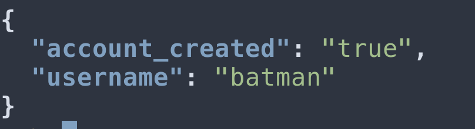
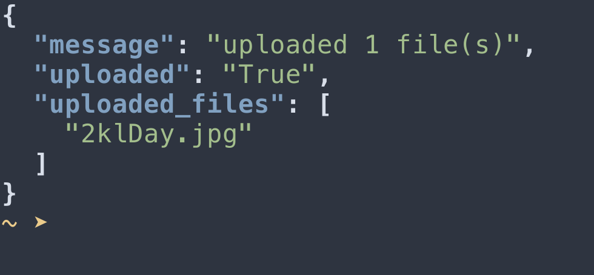
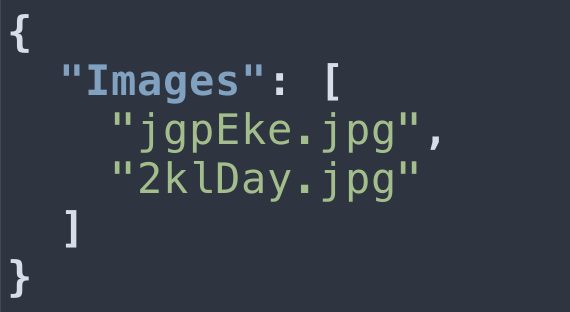
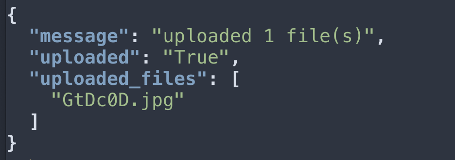

## My solution to the 2021 shopify developer challenge 


### What i focused on 

- Adding images to the repository (supports single and bulk uploads)

- Private/Public permissions

- Securing uploading and storing images 


Usage 

The easiest way to get up and running with this project is with docker , for convinence i have created a public docker image 


Pull the image 
```shell
$ docker pull e770r/sdc
```

Run the server 
```bash
$ docker run -d -p 8080:8080 sdc 
```

To make uploads you would need an account,  so create one using the follwing curl command 

```shell
$ curl -d '{"username":"batman", "password":"wootwoot"}' -H "Content-Type: application/json" -X POST http://localhost:8080/users/create | jq

```

Output 



Now you have an account you can make an upload 

``` shell 
curl -u batman:wootwoot -X POST  -F "files[]=@./mycoolimage.jpg"  localhost:8080/public/upload    
```

Output




View all publicly available images 

```shell
 curl localhost:8080/public/images | jq       
```

Output 




Image uploads are secured by first validating the file extension and preventing a directory [traversal attack](https://www.acunetix.com/websitesecurity/directory-traversal/) using an in built function  of flask. 


Create a private image 

```shell
$ curl -u batman:wootwoot -X POST  -F "files[]=@./secretimage.jpg"  localhost:8080/private/upload | jq 
```

Output 




To get all images for the user . Make a get request to `/private/images` .

```shell
 curl -u batman:wootwoot localhost:8080/private/images | jq    
```

Response
```json
{
  "Images": [
    "GtDc0D.jpg"
  ]
}
```

confirm your image is not public buy looking at all the images available 

```shell
 curl localhost:8080/public/images | jq       
```

```json
{
  "Images": [
    "jgpEke.jpg",
    "2klDay.jpg",
  ]
}
```